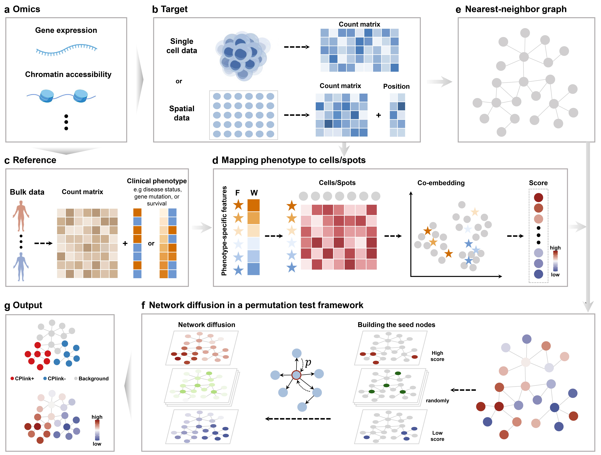

# CPlink: Linking Cell or spot to clinical Phenotype
Mapping clinical phenotype to single-cell and spatial omics profiles 

## Overview
We introduce CPlink, an interpretable, unified, and flexible computational framework that identifies clinical phenotype-associated cells or spots from single-cell or spatial omics data leveraging reference bulk omics data for enhanced disease prediction and biological discovery.

<p align="center">
 
</p>

# Installation
To run ``CPlink`` R package, install from GitHub through ``devtools`` directly:
```R
install.packages('devtools')
library(devtools)
devtools::install_github("jiaojhua/CPlink")
```

# Tutorials
CPlink is designed to identify cells or spots associated with phenotypes by transferring prior phenotype knowledge from bulk or predefined signature data to single-cell or spatial omics data. Here, we provide example workflows on multiple data modalities.

* For ST, please see [here](https://github.com/jiaojhua/CPlink/blob/main/vignettes/Tutorial-ST.ipynb), datasets are available at this [link](https://github.com/jiaojhua/CPlink_analysis/tree/main/Testdata/ST).

* For scRNA-seq, please see [here](https://github.com/jiaojhua/CPlink/blob/main/vignettes/Tutorial-scRNA-seq.ipynb), datasets are available at this [link](https://drive.google.com/drive/folders/1cp5thfClw262LneR3bm9jnf8jqIWN-yH?usp=drive_link).

* Single-cell ATAC-seq data
By default, CPlink requires the scATAC-seq count matrix, metadata, and fragment files, and bulk ATAC-seq count matrix and phenotype metadata as input.
Examples of CPlink on scATAC-seq data: [Tutorial](https://github.com/jiaojhua/CPlink/blob/main/vignettes/Tutorial-scATAC-seq.ipynb) [Data](https://drive.google.com/drive/folders/1vM-qbFdxVd2UnX-vnTQwCXOtm6Pz7Z7f?usp=drive_link).

* For CPlinkPrior, please see [here](https://github.com/jiaojhua/CPlink/blob/main/vignettes/Tutorial-CPlinkPrior.ipynb), datasets are available at this [link](https://drive.google.com/drive/folders/117W5neDCXxcnlfKPLeqM8LEWgcdvmVwy?usp=drive_link).

# Dependencies
- Seurat v4.4.0
- Signac v1.13.0
- CelliD v1.10.1
- DESeq2 v1.42.1
- survival v3.7.0
- proxyC v0.4.1
- Matrix v1.6.5
- parallel v4.3.3
- doParallel v1.0.17
- methods v4.2.0
- foreach v1.5.2
- edgeR v4.0.16
- limma v3.58.1

# Contact
If you have any questions, please feel free to contact Jiao Hua (jhua@stu.hit.edu.cn).
